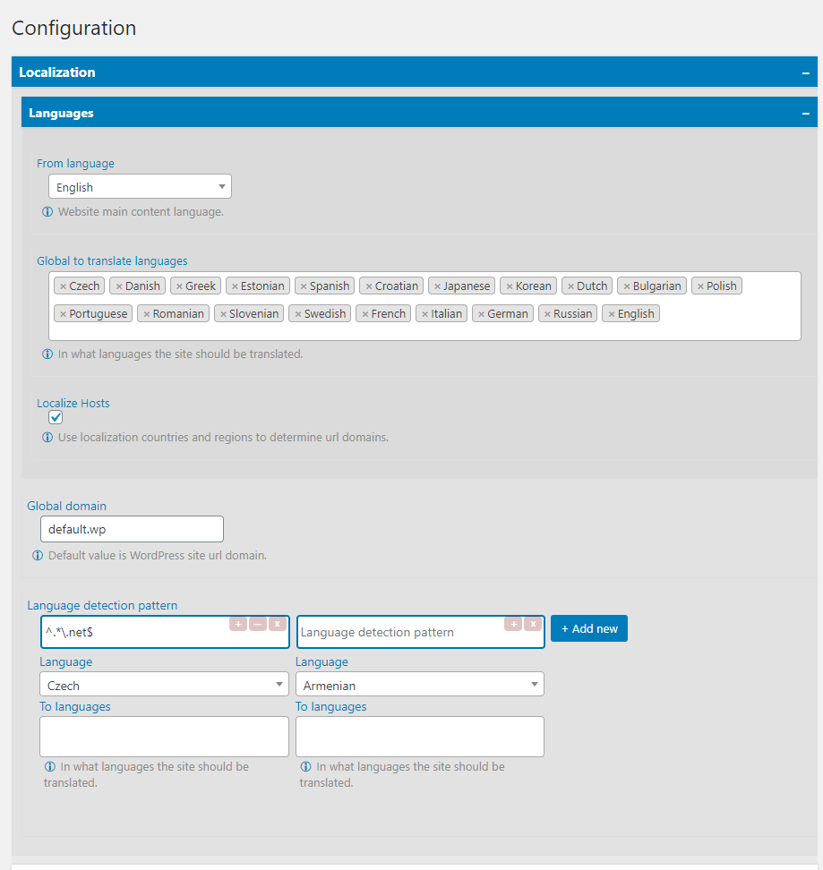

# WordPress options form dynamic fields creation library

Create dynamic admin settings page with flexible configurations.

## Methods
* Single
* Multiple

## Types
* Boolean
* Text
* Object
* Group

## Markup
* Text
* Checkbox
* Select
* Number
* Textarea



# How to install

### Install with composer

On your custom plugin directory run this composer command

```bash
composer require diazoxide/wp-lib-option:dev-master
```

Or add in your `composer.json` require field

```json
{
 "require": {
    "diazoxide/wp-lib-option": "dev-master"
  }
}
```

# How to use

For example we have multidimensional array `$config` that have one static value `name`,
two dynamic values `country` and `other->is_solder`.

`country` field should be set by user from admin side

```php
use diazoxide\wp\lib\option\v2\Option;

$config = [
    'name'=>'Arthur',
    'country' => new Option(
        [
            'default'     => 'uk',
            'type'        => Option::TYPE_TEXT,
            'method'      => Option::METHOD_SINGLE,
            'values'      => [
                'fr'=>"France",
                'uk'=>"United Kingdom",
                'it'=>"Italy"
            ],
            'label'       => 'Country',
            'description' => 'Select country.'
        ]
    ),
    'other'=>[
        'is_solder'=>new Option(
             [
                 'default'     => false,
                 'type'        => Option::TYPE_BOOL,
                 'label'       => 'Solder or not'
             ]
         )
    ]
];
```

## Print this config form

```php
Option::printForm(
    'custom_index_key_for_config',
    $config,
    [
        'title' => 'Arthur Configuration'
    ]
);
```
If change values from printed form and click save, then all changes will be stored on `wp_options` 
table with custom `custom_index_key_for_config` prefix.

## Getting final values of this options

```php
$options = Option::expandOptions(
    $config,
    'custom_index_key_for_config'
);
```

So we have already expanded options with dynamic and static values. You can use it simply.

#### For example
```php
echo $options['name']; // Output: Arthur

echo $options['country']; // Output is dynamic. Default value is `fr`

var_dump($options['other']['is_solder']); // Output is dynamic. Default value is `false`
```